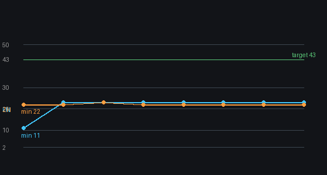

# PhyWear 腕上智慧物理工坊 · 技术报告

> 2026 首届 openvela AI 硬件开发者大赛 · 作品技术报告（v2，2026-09-13 整合）
> 队伍：contest2026_427_xinpingqihe（xinpingqihe） · 硬件：立创·黄山派（SF32LB52-MOD-1-N16R8）
> 专属仓：https://github.com/open-vela/contest2026_427_xinpingqihe
>
> **本报告如实撰写：有就是有，没有就是没有。** 官方提供的成果（EPIC 硬件加速）与本队原创成果明确区分；
> 未实现/已验证环境一律标注清楚，不把"模拟器实测"写成"真机实测"，不把官方成果写成本队自研。

---

## 1、概述与工作基础归属

| 项目 | 内容 |
|---|---|
| 作品名称 | openvela 腕上智慧物理工坊（PhyWear）—— 手表版 phyphox |
| 队伍 | xinpingqihe（编号 427）。**XPQHyue**：技术负责人（驱动 / 板级 bringup / LVGL 应用 / 算法 / i18n / 性能 / 真机验证 / 提交）；**程秋霞**：文档校对、演示视频、线上传播（B 站） |
| 选题 | **③ 新硬件平台适配**（主打），并集成官方 AI Agent 做语言交互 |
| 平台 | openvela（NuttX）· 立创黄山派 SF32LB52-MOD-1（AMOLED + 触控 + 6 轴 IMU + 地磁 + 环境光 + 麦克风 + 扬声器） |

**一句话**：把 phyphox 的手机端物理实验搬到腕上，用板载真实传感器实时采集、端侧算法分析、LVGL 全中文界面呈现，
并可用自然语言（AI Agent）驱动页面与读数。

**工作基础归属（重要，务必区分）**

| 模块 | 来源 | 说明 |
|---|---|---|
| `vendor_sifli` **PR #31** | **官方（非本队）** | NuttX LCD/framebuffer 驱动、双缓冲、EPIC 图形加速 HAL、DMA 拷贝 |
| `apps_graphics_lvgl` **PR #41** | **官方（非本队）** | LVGL 注册 SiFli EPIC draw unit（fill/border/image/label/layer 卸载到 EPIC） |
| `nuttx-apps` **PR #121** | **官方（非本队）** | 编译构建支持 |
| `packages/ai_agent`（openvelaClaw） | **官方（非本队）** | AI Agent 引擎、工具注册框架、消息总线、Skill 加载器 |
| 传感器驱动 / 板级 bringup / 触控修复 / LVGL 应用 / 算法与图表控件 / i18n 与 CJK 字体 / 性能优化 / AI 工具与 Skill | **本队原创** | 见第 4、5、6 节 |

> 本队**未自研** EPIC 硬件加速与 AI Agent 引擎；本队工作是在官方基础上做**集成、驱动、应用、算法、优化与验证**。
> 玩法与实验场景参考 **phyphox**（RWTH Aachen，GPL v3），本作以 **C + LVGL 独立重实现**，未复制其 Android/Kotlin 代码体，源码 Apache-2.0。

---

## 2、系统架构与数据流

**图 1：系统总体架构**（绿=本队原创，橙=官方提供）


```
应用层（本队）  phywear_ui / phywear_raw / phywear_pend|spring|centri|incline|ruler|spec|time|life|tone
                pw_graph + pw_scope（图表控件）/ pw_analysis（算法库）/ phywear_i18n + pw_font_*
AI 层（官方引擎 + 本队工具）  packages/ai_agent ⇄ pw_ai 邮箱桥 ⇄ GUI 线程；Skill → /data/agent/skills/
图形栈（官方 EPIC 后端 + 本队用法优化）  LVGL 9.1.0 → EPIC draw unit → 双缓冲
显示/板级（官方 PR + 本队修复）  LCD/FB + co5300 AMOLED + FT6146 触控（本队修 EPIC 栈上触控）
驱动层（本队）  mmc5603(/dev/mag0) · ltr303(/dev/light0) · sf32lb52_mic(/dev/mic0) · sf32lb52_spk(/dev/spk0)
系统  openvela(NuttX) · SiFli SF32LB52 · 黄山派硬件
```

**图 2：数据流与关键流程**


传感器 → `/dev/*` 字符设备 → `phywear_sensors`（单位换算与线程安全访问）→ 页面缓冲 →
`pw_analysis`（FFT / 自相关 / 最小二乘）→ `pw_scope`/`pw_graph`（CPU 光栅进 RGB565 小缓冲）→
`lv_image` → EPIC **IMAGE** 硬件 blit → AMOLED；AI 侧：Agent 工具 → `pw_ai` 互斥邮箱 → GUI 线程执行切页/采样。

---

## 3、硬件平台

| 部件 | 规格 | 本队使用情况 |
|---|---|---|
| SoC / 存储 | SF32LB52-MOD-1-N16R8：16 MB NOR（XIP @0x12010000）+ 8 MB OPI-PSRAM | PSRAM 已纳入堆（`MM_REGIONS=2`），运行空闲堆约 7.7 MB |
| 显示 | 1.85" 390×450 AMOLED（CO5300，QSPI），双缓冲 | 16 主页面 + 声学页全中文渲染 |
| 触控 | FT6146 电容触控（I2C1），单点（`maxpoint 1`，不支持双指捏合） | 官方 EPIC 栈上曾失效，**本队修复**恢复 |
| IMU | LSM6DS3TR-C（官方驱动 `/dev/lsm6dsl0`，acc mg / gyro mdps） | 摆测 g、弹簧、向心、频谱、秒表、摆动检测 |
| 地磁 | MMC5603NJ（**本队驱动** `/dev/mag0`，20 bit ×0.0625 mG） | 磁性标尺、磁场频谱 |
| 环境光 | LTR-303ALS（**本队驱动** `/dev/light0`，CH0/CH1 → lux） | 环境光页、光学快门 |
| 麦克风 | 板载模拟 MEMS + 片内 AUDCODEC ADC（**本队驱动** `/dev/mic0`，16 kHz/16 bit） | 声音频谱、声学快门、掌声计、麦克风电平页 |
| 扬声器 | 片内 AUDCODEC DAC0 → 外部功放（PA42 = `AUDIO_PA_CTRL`）→ 喇叭（**本队驱动** `/dev/spk0`，2026-09-13 新增） | 音频发生器、扬声器页、声学标定 |
| 控制台 | UART1 + CH340N，1 Mbps 8N1；**RTS 直连 SoC 复位** | 烧录/自测自动化（脚本"脉冲复位→等提示符→发命令"） |

---

## 4、软件实现

### 4.1 LVGL UI 框架与页面（本队）

- **导航 3 层**：主菜单宫格 → 板块实验列表 → 实验页；`操作 ≤3 步`、深色底（#101418）、数值大字号（28/48px）。
- **页面规模**：**16 个主页面**（根菜单 / 原始传感器 / 12 个实验与工具页 / 设置 / 关于）
  + 本日新增声学**「音频发生器」**页、以及原始传感器板块的第 5/6 子页（**麦克风、扬声器**）。
- **统一实验页骨架**：顶栏 →（工具行）→ 多视图横滑区（值卡 / 图卡 / 参数卡 / 说明卡）→ 状态行；
  参数内嵌实验页，保证"≤3 步到结果"。
- **代码结构**：`phywear_ui.c`（屏幕栈管理/宫格/列表）、`phywear_raw.c`（原始传感器 6 页横滑）、
  `phywear_<experiment>.c`（各实验页）、`phywear_sensors.c`（设备访问与单位换算）。
  截至 2026-09-15：**44 个非字体源文件 / 15,807 行**，另有 5 档 CJK 字体文件（生成物）。

**UI 第二批 (a)(b)(c)（2026-09-15；同日按用户反馈做过一次修订）**

三个三轴页（加速度/陀螺/地磁）有**两种视图**，轻点页面任意处或右下角自绘图标按钮切换；
**默认是"数值视图"**（= 改动前的原版风格，与「环境光」页一致）：

| 视图 | 内容 |
|---|---|
| **数值（默认）** | 3 行「轴字母 X/Y/Z（28 px，暗色）+ 大数字（48 px，带单位，如 `+0.98 g`）」，右下角切换按钮 |
| **图线** | 页眉名+单位（单位紧跟名字）→ 一行三列数值（轴字母 20 px 系列色 + 数值 28 px）→ **358×186 三泳道曲线** → 左下**每轴满量程**（如 `+/-1 / 0.20 / 1 g`）+ 右下时间窗 `8 s` |

- **为什么加双视图**：用户反馈"曲线优化不行、变化不明显，体验不如原来的大数字风格"。
  根因是**三轴共用一个满量程**被最大的那根顶住（重力让 Z≈1 g → 量程 2 g），
  于是 0.12 g 的 Y 轴在 62 px 泳道里只剩 **~3 px** 摆动，看着就是直线。
- **修订一：每轴独立量程**（`pw_scope_set_lanes_i16()` 改为收 `inv[]` 数组）——
  同一条 Y 轴改后幅度到 **±16 px**，肉眼可见；量程下限同时压低
  （加速度 0.2..8 g、陀螺 5..2000 dps、地磁 20..30000 mG），否则下限会把小信号压回直线。
- **修订二：零新增控件**：两种视图**复用同一批标签对象**（只改字体/位置/宽度/颜色），
  不新增 label，避免吃 LVGL 堆。
- **修订三：切换按钮用自绘图标**（折线 = 点它看图线；三横条 = 点它看数值）——
  本队 CJK 字体子集里**没有「曲」字（U+66F2）**，写"曲线"会显示方框，而重生成字体子集有 ~0.5 天流程成本。
- **零新增 SRAM 缓冲**：曲线仍复用 `pw_scope`（CPU 光栅化 RGB565 → `lv_image` → EPIC 硬件 blit），
  3 条泳道共用 **1 块**缓冲、每页只占 **1 个 scope 槽位**。
- **历史样本**用 `int16_t g_raw_hist[3][80]`（80 × 100 ms = 8.0 s），**三轴页共用一份**；
  进页即清零。存储时 ×k（加速度 4000 / 陀螺 16 / 地磁 1）饱和到 int16，绘制时统一换算 ——
  这样自动量程变化不会污染历史数据的量纲。
- **自动量程**按 **整条窗口**的峰值取 1-2-5 步进档（涨快落慢：回落需低于半量程），
  且**每轴各算各的**；用瞬时值会因正弦过零点掉档（曾出现"数值写 ±50 dps、曲线按 20 画"）。
- **泳道颜色**固定 X=红 / Y=绿 / Z=蓝（跨三页一致，便于对照），色板取自本队自定义系列色
  （已整体平移避开 phyphox 色板，见 `NOTICE.md`）。
- **无头验证**：新增 `phywear tap <x> <y>`（模拟器专用，往 `/dev/utouch` 注入
  DOWN→150ms→UP 的真实点击）与 `phywear cap rawcurve`（直接开图线视图），
  因此"点击切换"是**注入事件验证过**的，不只是看两张静态图。
- 真机截图见 `docs/evidence/ui-batch2-20260915/`（`rev-*` 系列）；帧率/内存实测见该目录 `README.md §4`。

**(b) 倾角页：指针式角度盘**

- **13 根刻度短线**（`lv_line`，-90°..+90° 每 15°，每 30° 一根长粗刻度）+ **指针**（`lv_line`）
  + 盘心圆点；0° 在正上方、±90° 满偏、正值向右；刻度按当前角度**逐格点亮**。
- **不用 `lv_arc`**：实测软件圆弧绘制把本页真机帧率从 ~26 拉到 23；改刻度线后回到 25
  （落在改动前 25~27 区间内）。
- 两个关键优化：① `lv_line` 的**对象框收紧到线段自身包围盒**（`lv_line_set_points()` 失效的是
  整个对象框，保持 168×168 会让每次移针重画整盘）；② 指针 12.5 Hz 节流 + 位移 <1° 不重绘
  （静止的手表零绘制开销）。

**(c) 秒表页：环形计时进度**

- `lv_arc` 满环 + **环心实时秒数**：满环 = "上次间隔"（还没有就取 2.0 s），跑动中按
  `elapsed/ref` 填充；超过上次间隔 → 满环 + 换"偏慢"色（橙）；停下时满环但用暗色。
- **只在值与颜色真的变了才写对象**：`set_style_arc_color()` 每次调用都会让整个圆弧对象
  重绘（156×156），闲时每 100 ms 白刷一次很吃亏。
- 真机帧率 10.3 → 9（稳定少 1 帧）：环心读数落在圆弧对象框内，读数每 100 ms 变一次会连带
  重绘圆弧。**可选修法**（未做）：圆弧也改成分段刻度环。

**本批帧率与内存（真机实测，同页同 bench，30 s 窗口）**

| 页面 | fps 前 | fps 后 | loops/s 前→后 |
|---|---|---|---|
| 原始传感器（三轴曲线） | 12 | 12 / 12 | 63 → 59 |
| 倾角（指针盘） | 27 / 27 / 25 | 25 / 25 / 25 | 27 → 25 |
| 秒表（环形进度） | 11 / 10 / 10 | 9 / 9 / 9 | 61 → 59 |

SRAM 489,440 → **490,648 B（93.58%）**，**+1,208 B**；flash 2,062,680 B（12.29%）。

> 为拿到真机帧率，本批把原来"只在 `bench` 模式打印"的帧率探针接进 30 s 心跳，并修掉一个
> 真机缺陷：原 `pw_fps_init()` 只在 `/dev/fb0` 可 mmap 时装回调，而**真机没有 `/dev/fb0`**
> （只有 `/dev/lcd0`），真机 `fps` 恒为 0。现改为挂 `LV_EVENT_RENDER_READY`
> （`lv_refr.c` 只在本轮真的有区域重绘时才发），模拟器/真机都成立，且不再替换 flush 回调。

### 4.2 传感器与声学驱动（本队）

| 驱动 | 节点 | 实现要点 |
|---|---|---|
| `mmc5603.c`（550 行） | `/dev/mag0` | SET/RESET 消偏、`CTRL0.AUTO_SR` 偏置修复（对照 Zephyr 主线）、寄存器语义按数据手册校准 |
| `ltr303.c`（398 行） | `/dev/light0` | CH0=可见+红外、CH1=红外；`lux=(CH0−CH1)×0.6` |
| `sf32lb52_mic.c`（318 行） | `/dev/mic0` | AUDCODEC 单端 ADC + DMA1_Channel4 单次采集，16 kHz/16 bit/1024 样本；本日把增益 0 → **+30 dB**（见 6.5） |
| `sf32lb52_spk.c`（411 行，**本日新增**） | `/dev/spk0` | AUDCODEC DAC0 + DMA2_Channel1 **循环播放**，功放使能脚 PA42；ioctl `TONE/STOP/VOLUME/PA`；默认 +12 dB |

三个传感器驱动合计 1,266 行（含板级 I2C/AUDCODEC 注册与两套板级配置约 1,505 行，已提 **nuttx PR #378**）。

### 4.3 物理算法与图表控件（本队）

- `pw_analysis.c`（627 行）：**radix-2 迭代 FFT**（位反转+蝶形）、**自相关测周期**（首峰粗估 + 末谐波峰精化）、
  过原点**最小二乘**拟合、峰值**抛物线插值**、阈值状态机（滞回 + re-arm）。
- `pw_graph.c` + `pw_scope.c`（1,274 行）：实时滚动曲线与可缩放/平移折线-散点图（多序列、坐标轴、Fit/Auto）；
  2026-09-15 增加 `pw_scope_set_lanes_i16()`（多泳道 + int16 样本 + 环形/线性历史，仍只用 1 块缓冲）。
- 典型链路（摆测 g）：IMU 角速度 50 Hz × 500 点（≈10 s）→ 自相关求周期 T → `g = 4π²L/T²`；真机实测误差约 **1.8%**（L=0.5 m）。

### 4.4 国际化与 CJK 字体子集（本队）

- **i18n**：单份 ID 枚举 + EN/ZH 双表，运行时可切换（`PW_STR()`）；当前 **238 条 ID**。
- **CJK 字体**：Droid 子集 + Montserrat 合并，5 档字号（14/16/20/24/28）。
  本日新增 `tools/phywear/gen_font_ranges.py`（从中文表与应用字面量收集码点）与 `gen_fonts.sh`
  （lv_font_conv 重生成），本次覆盖 **534 个中日韩码点**，解决新增声学文案的缺字方框（见 6.4）。

### 4.5 声学功能（本日完成，真机验证）

- **扬声器通路**：`/dev/spk0` + 命令行自检 `phywear tone <Hz> [ms] [dB]`；连续播放 440/660/880/1760/220 Hz
  **五段全部成功**（修复前只有第一段能响，见 6.5）。
- **音频发生器页**：频率 40 Hz–4 kHz（±20 Hz 步进 + 220/440/880/1760 预设）、音量 −36~+30 dB、播放/停止，
  离开页面自动停声；界面截图见 `evidence/acoustic-20260913/tone.png`。
- **麦克风**：原始传感器板块新增「麦克风」页（dBFS 峰值 + 32 段电平柱，后台线程读 `/dev/mic0`）；
  自检命令 `phywear micread [n]` 打印 peak/dBFS/rms。
- **声学通路实测**（真机）：静音环境噪声约 570 LSB；扬声器放 1 kHz 正弦时麦克风峰值最高 **12,000 LSB（−8.4 dBFS）**（贴近、最大音量）。**注意：同板喇叭→麦克风耦合弱，常规音量下与环境噪声同量级，低频段谱峰常落在二次谐波上——不能当"已知声源校准频谱"用**
  → 喇叭→空气→麦克风链路成立。

### 4.6 AI Agent 集成（官方引擎 + 本队工具/Skill/桥）

- **4 个 PhyWear 工具**（本队，`tool_phywear.c` 541 行，注册进 `tool_registry`）：
  `phywear_list_experiments` / `phywear_open_screen` / `phywear_read_sensor` / `phywear_run_experiment`。
- **线程安全解耦**：LVGL 非线程安全，Agent 线程**不直接调 LVGL**；切页请求写入互斥邮箱（`pw_ai.c`），
  由 GUI 主循环轮询执行。
- **自定义 Skill（大赛硬性项）**：`phywear-physics-coach.md`（5,165 B）——
  页名对照表、4 个工具用法、标准流程、物理关系（g/L/T、lux 量级、频谱主频）、边界条件。
  正本随应用源码入库，固件启动时由 `pw_skill.c` 安装到 `/data/agent/skills/`（真机 `/data` 是 tmpfs，重启即空），
  内容由 `tools/phywear/gen_skill_blob.py` 从 `.md` 生成 C 数组（`--check` 可做漂移自检）。
  **模拟器实测**：技能摘要 784 B（10 个内置）→ 1135 B（+351 B，正好一条），设备副本与仓内正本 md5 一致。
- **离线可用**：Agent 的关键词直通表（命中即本地执行工具、不经 LLM）已补 PhyWear 意图，
  无 Key / 断网也能"打开单摆""读加速度""跑单摆实验"。
- **真机状态**：真机已烧入含 `ai_agent` 的固件 —— Agent 启动、40 个工具注册（含本队 4 个）、
  **Skill 自动装机成功**、Agent loop 运行、事件经消息总线被消费（见 6.6、6.7）。
  **真机 LLM 对话未验证**（真机无网络栈、未配置 Key）；LLM 路径在 goldfish 模拟器验证。

---


### 4.7 「主动 + 执行」场景（本队，2026-09-15 打通）

赛道要求"至少一个主动 + 执行的场景"（纯对话不算）。PhyWear 的实现是：

```
晃表 → GUI 循环 10Hz 检测"持续摆动"(窗口振幅 + 连续 2.5s + 60s 冷却)
     → 事件写进手表 AI 消息日志，并 pw_ai_ask() 推给端侧 Agent
     → Agent 离线意图表命中关键词 → 调 phywear_run_experiment{screen:"pendulum",seconds:10}
     → 经邮箱请求 GUI 线程打开单摆页（LVGL 只在 GUI 线程动）
     → 单摆页自己 50Hz 采样/解算 g，算完 pw_ai_publish_result() 登记结果
     → 工具【只等结果、读结果】(自己不采样 IMU) → 回复经 humanize 进手表日志
```

**架构关键**：I2C 上**永远只有 GUI 那一路采样**。09-13 那次"启动十几秒整机卡住"的真因就是
Agent 任务里也按 50Hz 采同一颗 IMU（oneshot 还每样本 open/close 一次），两路抢同一条 I2C；
本次把 Agent 侧采样彻底删掉，改成"开页 → 等页面登记结果 → 读结果"。

**本次修掉的两个真崩溃**（都是之前没人查到底的）：

| 现象 | 根因 | 修法 |
|---|---|---|
| Agent 没起来时一推事件就 panic（`task: phywear`） | `velaclaw_client_open()` 在总线未初始化时也会成功，随后 `velaclaw_ask → msg_queue_push → pthread_mutex_take` 撞 `DEBUGASSERT(NXSEM_IS_MUTEX)`（`semaphore.h:625`） | 新增 `message_bus_ready()`，本地客户端 `open()` 阶段即拒绝并返回 NULL；`pw_watch` 改走受保护的 `pw_ai_ask()` |
| Agent 起来后工具末尾 ASAN 双重释放 | `pw_tool_emit()` 内部已 `cJSON_Delete(root)`，新写的分支又删一次 | 去掉两处多余 delete |

> 崩溃 1 不只影响主动场景：**AI 教练页的按钮**同样走 `velaclaw_ask`，"Agent 没起来时点按钮"
> 一样会把整机打崩。现在两条路都安全（模拟器实测：干净记一条"not connected"并继续存活）。

**「Agent 开机自启」缺口**：文档原写"端侧 loop 开机启动"，但板级 `etc/init.d/rcS`/`rc.sysinit`
都是 0 字节，`ps` 里从来没有 `ai_agent`（要手敲）。本次把 `ai_agent &` 写进板级
`etc/init.d/rc.sysinit`（该文件由 `src/CMakeLists.txt:52-53` 打进 ROMFS `/etc`）。
⚠️ 该文件会被 **C 预处理器**处理，**行首不能用 `#` 注释**（会当成非法预处理指令导致构建失败）。

**结果上报的三道有效性门**（只决定"要不要上报给 Agent"，页面上的原始数值不过滤、不隐藏）：
① 独立数据（≥1s 新样本，否则连续两次分析的是同一段数据，稳定性检查形同虚设）；
② 可复现（连续两次估计相差 ≤8%）；③ 合理性（g ∈ 5..15 m/s²）。
效果：真机静止 70s 内，上报垃圾值从 **~3 条/秒** 降到 **1 条被拦 + 1 条漏过**（拦截可审计）。
**残余风险如实写**：窗口内仍可能漏（实测漏过 7.52 m/s²）；桌面振动能连续产生各种垃圾值，
**主动场景的测量值只有在用户真的摆动时才有意义**。

证据与复现：`docs/evidence/proactive-20260915/`（含真机开机自启日志、`ps`、拦截日志、复现脚本）。


### 4.8 惯性标尺 / 位置标定（③，2026-09-15 起）

**目标**：把 IMU 全链路变成可测量的"标尺"——姿态可信、零偏可标、位移有限度地可测，
并且**每个数字都有真值来源**。分两块：

**(1) 姿态解算 `pw_ahrs.{c,h}`：Mahony 显式互补滤波（MARG 9 轴）**

选它而不是 Madgwick/EKF 的理由：零偏是**显式积分状态**（可以报出来、可以标）、
算力最低（~100 flop/次）、磁力计只修偏航（权重 `wmag` 默认 0.5，且**默认不进积分**——
磁噪声被积进零偏会让偏航游走，实测 σ_yaw 从 2.7° 涨到 12°）。状态 76 B，无静态数据。

实现要点（都是踩过坑才定下来的）：
- **误差项符号**：`e = a×v + wmag·(m×w)`，`ω = gyr − bias + kp·e`，`bias −= ki·ei·dt`；
  其中 `v = Rᵀ·[0,0,1]`、`w = Rᵀ·[bx,0,bz]`、`bx=√(hx²+hy²)`（只让偏航可观测）。实测无零偏
  静置收敛 **0.88°**，验证了符号与坐标约定。
- **真实 dt**：调用方用 `CLOCK_MONOTONIC` 前后差算 dt，**不用固定标称值**（参考包那份
  MATLAB 就是固定 `1/200 s`，上游丢帧全被当成理想均匀网格）。
- **磁限速**：早期用"占空比限速"（只让 1/5 的更新带磁），冷启动偏航收敛慢一个数量级；
  改成"每次都用、但权重小"后 30 s 内收敛。
- **零偏的正解是静态标定**：滤波器自己的积分项 60 s 只能恢复 22%/88%/16%（偏航轴最差），
  未标定 0.5~0.7 dps 零偏会让偏航残留 ~11°。所以推荐流程是
  **先 `pw_calib_bias_*` 静止标定零偏 → 预置进滤波器**，实测残差回到 ~1°。

**(2) 标定数学 `pw_calib.{c,h}`：全部流式充分统计，不存原始样本**

| 方法 | 真值来源 | 本批实测（合成数据自检） |
|---|---|---|
| 一维/二维最小二乘 | 尺子/卷尺读数 | 系数还原到 1e-7，rms=0 |
| **六面法** 加速度零偏+刻度 | **重力**（理想读数 ±1 g） | 零偏误差 <1e-3 g、刻度 <1e-3、串扰 <1e-3 g |
| **磁椭球** 硬铁+软铁（9 参数代数拟合 + Jacobi 特征分解） | 当地 WMM/IGRF 的 \|B\|/倾角（**不得用"典型 50 µT"**） | 球心误差 **0.00 mG**、校正后模长离散 **0.000%** |
| **陀螺静态零偏** | 静止时角速度为零 | 还原准确；±2.9 dps 抖动被"不够静"判据拒绝 |

两个必须写清的边界：
- 磁椭球拟合**只能定出软铁矩阵到一个未知旋转**（`A` 与 `A·R` 给同一个二次型），
  本实现取对称平方根为规范选择；残留的偏航常数偏移要靠"对准已知方向/转台"消掉。
- 没有真值装置时，本库只能给"重复性"，**给不出"标定后精度"**。

**(3) 本批验证（三层，见 `docs/evidence/imu-ahrs-20260915/`）**

| 层 | 结果 |
|---|---|
| 主机单测 `tools/phywear/hosttest_math.sh` | 两个自检 rc=0（<2s，改算法不必烧板子） |
| 模拟器 `phywear ahrs` / `phywear calib` | rc=0；无 `/dev/mag0` 时自动退化 6 轴 |
| **真机** `phywear ahrs 20` | 1000 样本 50 Hz、1000 带磁；**AHRS 的 roll/pitch 与加速度计直接解算的倾角相差 ~0.5°**；mag 关时 yaw 以 ~2°/s 漂（与估出的 −2.18 dps 零偏吻合），mag 开后 **yaw 稳定在 75.6° 不漂** |

**已知限制**：精度指标尚未用转台真值验证（"静态 ≤0.5°"目前只是"与加速度计一致"的间接证据）；
合成噪声下姿态误差 2~3°、yaw σ≈2~3°，**增益仍需按真机数据标定**。
UI 板块归属（生活/工具）与真值测量参与方式待用户拍板，故本批只交付与 UI 无关的算法核心。

## 5、性能实测

**图 3：渲染帧率时序（模拟器 EN/ZH 序列，标注 min 22 / target 43）**



| 指标 | 真机（SF32LB52 + 官方 EPIC + 本队优化） | 模拟器（goldfish，无 EPIC，软件渲染） |
|---|---|---|
| 优化前 | 约 3 FPS | 每帧 ~43 ms（1280×800 全幅光栅） |
| **优化后（当前口径）** | **平均 41 FPS（render 22 ms / flush 0）** | **22–23 FPS** 稳定 |
| 历史口径 | 43 FPS（**2026-09-12 旧固件**，官方 LVGL benchmark 全场景 avg：81% CPU / 20 ms / flush 0） | — |
| 摆测 g 误差 | 约 **1.8%**（真机，L=0.5 m） | — |
| 稳定性指示 | GUI 主循环心跳 `[phywear] alive t=…s fps=…`（每 30 s，最新固件 63–69 loops/s） | 空闲堆 94.82 MB 恒定（±90 B，无泄漏） |

> **口径说明（如实）**：41 FPS 是本队 PhyWear 固件（2026-09-13）的全场景平均；43 FPS 是 2026-09-12
> 旧固件 + 官方 benchmark 的数字，两者都真机实测、**不可混用**。引用 43 FPS 时必须注明"9/12 旧固件口径"。

> **数据来源声明**：**模拟器没有真实传感器**，模拟器截图中的数值是占位符，仅证明中文界面与字体渲染；
> 用 `phywear <实验>bench` 打开的"说明/数据页"是**注入的合成信号**，不是测量结果；
> 真机 26 张截图（`evidence/realboard-20260912/`）中 16 张主页面数值来自板上实时传感器，但板子静止置于桌面、
> **非受控实验**，同样不可当作测量结论。**可引用的实测数据**：真机帧率（41/43 FPS）、摆测 g 误差 1.8%、
> 声学通路电平（最高 −8.4 dBFS，含弱耦合说明）、启动稳定性（5/5、6/6）、Skill 摘要字节数与 md5。

---

## 6、关键问题与修复（现象 → 定位 → 修复 → 验证）

### 6.1 组页点击卡死（悬空指针）

- **现象**：从组页（力学/计时器等）点入实验页即整机卡死，随后被看门狗复位。
- **定位**：实验列表的事件回调把 `&items[i]` 存进 `user_data`，而各 `ui_*_open()` 的实验表是**栈上局部变量**
  （条目用运行期 `PW_STR()` 求值，无法静态初始化）；点击时栈帧早已销毁 → `it->open` 变成垃圾值 → 跳非法地址。
- **修复**：回调只携带**函数指针本身**（`it->open`），不再引用表项地址（2 文件 +14/−5）。
- **验证**：修复固件 md5 `784855320611bafb3580f4808d52847a`（1,766,436 B，读回逐字节一致）；
  12/12 页面点击 + 26/26 截图校验通过；**用户手指实测确认不再卡死**。

### 6.2 真机启动偶发卡死（时钟/晶振建立时序）

- **现象**：镜像微变即"随机"启动失败，只打印 `AB`（或 `ABCD`）后无输出；同一源码重编有时好有时坏。
- **定位**：在 `sifli_start` → `HAL_PreInit` → `BSP_Board_PreInit` → PSRAM 各阶段用 `arm_lowputc` 插桩，
  确认卡点在 `BSP_Board_PreInit` 的**时钟/晶振建立窗口**内。
- **修复**：XTAL32 起振、DLL1 锁定（切 240 MHz 系统时钟前）、DLL2 锁定（切 FLASH2 XIP 时钟前）三处各补 2 ms 等待；
  PSRAM 通路在 1.8 V LDO 使能后同样补 2 ms。
- **排除项（均做过对照实验）**：ftab 分区窗口、`.data/.ramfunc` 加载地址越界、
  flash 烧写不完整（前 512 KB 逐块读回**逐字节一致**）、扬声器驱动本身。
- **验证**：连续 **5/5、6/6** 复位启动正常（含 2.03 MB 全功能镜像）；修复前镜像稳定复现卡死。

### 6.3 10 条 i18n 字符串双重转义

- **现象**：界面显示 `\xe2\x86\x92` 之类字面文本（箭头、±、°）。
- **定位**：生成 i18n 表时把 `\xNN` 又转义了一次，C 字符串里成了字面反斜杠。
- **修复**：改用 ASCII `->` / `+-` 与真实 `°`（字体子集含 0xB0，不含 0xB1/0x2192）。
- **验证**：真机 26 张中文截图逐张目检，无乱码、无缺字方框。

### 6.4 CJK 缺字方框（新增文案）

- **现象**：新增声学页面后按钮/标题出现方框（"播/扬/声/器/频/率/音/量"等）。
- **定位**：CJK 字体子集是按**旧字符串表**生成的静态子集，新字不在其中。
- **修复**：新增 `tools/phywear/gen_font_ranges.py`（从中文表 + 应用字面量收集码点）
  + `gen_fonts.sh`（lv_font_conv 重生成 5 档字号），本次 **534 个码点**。
- **验证**：真机截图中英文案恢复正常（`evidence/acoustic-20260913/tone.png`、`spk.png`、`mic.png`）。

### 6.5 扬声器：第二段声音永远失败（两层原因）

- **现象**：`phywear tone` 只有第一段响，其后全部 `failed`。
- **定位（两层）**：① 驱动反复 `Transmit_DMA/DMAStop`，第二次返回 `HAL_BUSY`（AUDCODEC 状态机不接受）；
  ② 应用侧 `pw_tone.c` 把 fd 缓存进**应用全局变量**（同一份 `.data` 跨多次运行存活），
  第二次运行时 fd 属于**上一个已退出的任务** → `ioctl` 返回 `EBADF`，把真实原因掩盖成 errno=9。
- **修复**：驱动改为 **DMA 常驻循环**（换频率只重填缓冲 + 静音/取消静音切换）；应用每次调用 open/close。
- **验证**：连续 5 段不同频率全部 ok；用户听感确认可出声；默认音量由 0 → **+12 dB**（用户反馈偏小）。
- **附带**：麦克风增益 0 → **+30 dB**——0 dB 时静音与大声都只有 15~40 LSB，+30 dB 后环境噪声约 570 LSB、
  1 kHz 正弦下峰值最高 12,000 LSB（−8.4 dBFS）；常规音量下同板声耦合弱（如实记录，不作闭环标定用途）。

### 6.6 跨任务 fd 导致 Agent 采样为 0

- **现象**：真机让 Agent 跑 `phywear_run_experiment`，返回 `{"samples":0,"error":"no accelerometer samples available"}`。
- **定位**：`pw_sensors_read_imu()` 用的是 PhyWear 任务里打开的 `g_imu_fd`；NuttX 的文件描述符属于任务/任务组，
  **Agent 任务里该 fd 无效** → 每次读取失败（同一进程内读则正常）。
- **处理**：如实记录为架构约束；因此"Agent 长时间采样并自动切页"的主动场景被关闭（见 7.2）。
  后续方向：**由 GUI 线程采样、Agent 只取结果**。

### 6.7 启动期 Agent loop 不启动（真机无网络）

- **现象**：真机重启后 Agent 各线程在跑、工具已注册，但事件进队列无人处理（日志里没有 `Agent loop started`）。
- **定位**：官方 `agent_main.c` 只在 `network_wait_connected()` 成功后才 `agent_loop_start()`；
  真机没有网络栈 → 该等待永远超时 → Agent "活着但聋"。
- **修复**：Agent loop 改为**开机无条件启动**（网络相关通道仍按连通性启动），并加幂等保护避免重复建线程。
- **验证**：真机日志出现 `Agent loop started, free heap: …` + `Buffers/Tools JSON loaded`；
  摆动事件可被 `Processing message from local_client:phywear` 消费。

### 6.8 中文技能摘要被按字节截断 → 云端 400（2026-09-13，LLM 链路）

- **现象**：模拟器上配好 LLM 后端后，每次调用都稳定返回
  `400 {"message":"Invalid JSON in request body"}`；同样的内容从电脑用 curl 发同一端点却是 200。
- **定位**：本地起代理抓设备真实请求体，发现**请求体不是合法 UTF-8**——第 3736 字节是 `0xe8`
  （三字节汉字的第一个字节），紧跟 JSON 的 `\n` 转义，即某个汉字被"按字节截断"切掉了一半。
  根因在 `packages/ai_agent/src/tools/skill_loader.c`：组装技能摘要/标题/描述时用
  `snprintf`/`memcpy` **按固定字节数**截断（`desc[256]`、`title[64]`、摘要缓冲），
  没考虑 UTF-8 字符边界；摘要进入 system prompt 后被 cJSON 原样写入请求体，网关解析失败。
  **任何写中文 Skill 的队伍都会踩到**。
- **修复**：新增 `utf8_safe_len()`，在三处截断点回退到最后一个完整字符（+38 行，1 个文件）。
- **验证（两轮）**：
  ① 修复后同一问题一次通过 —— `trace … llm=ok backend=0`，LLM **自主发起 4 次工具调用**
  （`phywear_list_experiments` → `phywear_open_screen{pendulum}` → `launch_quickapp` →
  `phywear_run_experiment{pendulum,5s}`），5 轮迭代、20 s 完成、中文作答；
  ② **严格复验**：只放 1 个中文 Skill 时摘要 1022 B 未触上限，不足以证明修复生效，于是放入
  **2 个中文 Skill 强制命中 `skills_buf[1024]` 上限**再抓包 —— 请求体 17,654 B 经 UTF-8 解码与
  JSON 解析**双双通过**（tools=40），同会话切回真实 MiMo 端点 `llm=ok`、2 次工具调用。
  证据 `docs/evidence/llm-20260913/`（含 `strict-utf8-verification.txt`）。
  该修复已编入真机固件 `075655ee…` 并完成启动复验。

### 6.10 曲线在多次进出页面后静默消失（`pw_scope` 槽位泄漏，2026-09-14）

- **现象（代码级推断 + 压测复现）**：带曲线的页面（单摆/弹簧/频谱/倾角/标尺/声学等）反复进出若干次后，
  曲线不再绘制，且**没有任何报错**。
- **定位**：`pw_scope.c` 只有 6 个静态槽位（`PW_SCOPE_MAX 6`），分配时 `g_nscope++`，
  **却没有任何释放路径**；而每次进入带图页面都会 `pw_scope_create()` 一次
  （6 个调用点：`phywear_pend.c:752`、`phywear_spring.c:503`、`phywear_spec.c:843/861/880` 等）。
  于是同一个 boot 里进出 6 次之后 `create` 返回 `NULL`，页面静默无图（每块缓冲 354×96×2 ≈ 68KB，
  同时还会持续吃堆）。
- **修复**：槽位加 `used` 标记 + 空闲槽优先复用；把内部结构绑到 LVGL 对象的 `LV_EVENT_DELETE`
  上（`pw_scope_del_cb`），页面被销毁时自动 `lv_free` 缓冲并归还槽位（`+63 行，1 个文件`，
  调用点无需改动）。
- **验证**：模拟器 `phywear demo` 自动巡页压测 —— 日志显示 `slot 0` 被 **acquire → release →
  acquire** 复用，不再单调递增，也未出现 `out of slots` 告警。

### 6.9 ROM 只打印 `SFBL` 不启动（ftab 缺失，2026-09-12）

- **现象**：上电只打印 `SFBL` 便停在串口下载模式，`sftool` 仍能秒连（误导为"硬件/供电问题"）。
- **定位**：flash 起始 `0x12000000` **没有 FlashTable**，ROM 读不到二级 bootloader 的 base/size/xip_base。
- **修复**：先写修正过 `xip_base`（`0x20020000` → `0x12010000`，与链接脚本 `flash ORIGIN` 对齐）的 ftab，再写固件；
  固化为 `flash_with_ftab.sh`（写 ftab → 写固件 → 读回校验）。
- **验证**：启动链 `SFBL → ABCD → NSH`；之后 26 张真机中文截图、43 FPS、PhyWear 应用全部复现。

### 6.11 迷你曲线自动量程抖动 + 根屏重建泄漏 scope 槽位（2026-09-15）

**现象 A：数值标注与曲线量程不一致。** 三轴页数值写 `+/-50 dps`，但曲线像素实测幅度达到
±fs（即按 20 dps 在画）——同一帧里两者对不上。

- **定位**：`raw_axis_curve_update()` 最初用**当前瞬时样本**求峰值 → 正弦过零点时峰值掉到 0，
  自动量程便在 20↔50 dps 两档之间反复跳（`raw_nice_fs()` 的 1-2-5 步进 + 回落阈值半量程）。
- **修复**：改用**整条 80 点窗口**（3 轴共 240 个样本）的峰值。
- **验证**：像素级复算（`docs/evidence/ui-batch2-20260915/verify_curve_scale.py`）——
  陀螺 X 幅度 ±19.13 dps（合成波形 ±20 dps，100 ms 采样最大值理论 ≈19.4），
  与 `+/-50 dps` 自洽；加速度 X/Y/Z 分别为 ±0.62 g / ±0.11 g / +0.69..+1.28 g
  （合成波形 ±0.6 / ±0.12 / 0.7..1.3 g）。

**现象 B：`phywear cap root` 连开几次后，原始传感器页曲线静默消失。**

- **定位**：`pw_ui_root()` 只把 `g_scr_n = 0`，**不删除仍在栈里的旧屏** → 旧屏的
  `pw_scope` 槽位不归还；原始传感器一屏占 3 槽，第 3 次起 `pw_scope: out of slots (6 in use)`。
  （正常导航路径由 `pw_scr_back()` 删屏，故只在反复重建根屏时暴露。）
- **修复**：先遍历栈删屏再重置计数器。
- **验证**：`phywear cap root` 后日志出现 `pw_scope: release slot 0/1/2`，再开页槽位正常。

---

## 7、已知限制（未实现的如实标注）

1. **真机无网络栈**：镜像内没有 WiFi/BLE 协议栈与网卡驱动，**未配置 LLM Key** →
   真机的 LLM 对话不可用；LLM 路径仅在 goldfish 模拟器（有 virtio-net）验证。真机的 AI 能力表现为
   工具注册 + Skill 装机 + 离线关键词直通。
2. **主动场景已关闭**：摆动检测本身在真机工作正常（实测多次触发、日志有振幅/时长），
   但"检测到摆动 → 推给 Agent → Agent 长时间采样并切页"会与 GUI 线程抢 IMU/抢切页（见 6.6），
   真机实测必卡，故默认关闭（`PW_WATCH_PROACTIVE 0`，只打日志）。后续方向（已讨论、暂搁置）：
   无障碍播报、首次开机语音引导、结果语音播报。
3. **`Ctrl-C` 杀不掉 `phywear`**（固件未开 `CONFIG_TTY_SIGINT`）→ 退出 GUI 只能复位板子。
4. **同一次开机内第二次启动 GUI**（再敲一次 `phywear`）会挂在 LCD 驱动 → 需复位后再启动。
5. **模拟器没有真实传感器**：模拟器数值是占位符；bench 页面是注入的合成信号，不能作为测量结果。
6. **声学未做完的部分**：多普勒、历史频率、声呐未实现；麦克风为 16 kHz（碰撞实验需 48 kHz 分频改造）。
7. **端侧运动识别 / 手势启动 / 自定义实验构建器**未实现（界面占位标注"规划中"）。
8. **演示视频尚未录制**（脚本已按真机重写为 v2）；提交用材料仍在整理。

---

## 8、附录：开发过程与优化记录

### 8.1 板块与功能清单（现状）

| 板块 | 内容 | 状态 |
|---|---|---|
| 原始传感器 | 加速度 / 陀螺 / 磁力 / 环境光 / **麦克风** / **扬声器**（6 页横滑）；**三轴页 = 一行三列数值 + 358×186 三泳道迷你实时曲线**（2026-09-15） | ✅ 真机 |
| 力学 | 摆测 g、弹簧振子、向心加速度 | ✅（弹性碰撞未做：需 48 kHz 麦克风） |
| 声学 | 声音频谱、**音频发生器（新）**；历史频率 / 多普勒未做 | ✅ 部分 |
| 工具 | 加速度频谱、斜面倾角（**指针式角度盘**，2026-09-15）、磁性标尺、磁场频谱 | ✅ 真机 |
| 计时器 | 运动秒表（**环形计时进度**，2026-09-15）、光学快门、声学快门 | ✅ 真机 |
| 生活 | 掌声计 | ✅ 真机 |
| AI 教练 / 自定义 | 语言交互 Agent + Skill 已落地；端侧运动识别、实验构建器为占位 | ⚠️ 部分 |

### 8.2 性能优化过程（关键结论）

- **摸清 EPIC 边界**：官方 EPIC draw unit 只卸载 `FILL/BORDER/IMAGE/LABEL/LAYER`，**不含 LINE** →
  `lv_chart` 折线 100% 落回软件渲染，是性能黑洞。
- **瓶颈实测**（`phywear pendbench`，avg loops/2s，越大越空闲；lv_chart 灾难线 ≈2–4）：

  | 场景 | 结果 |
  |---|---|
  | 空闲主菜单 | 168 loops/2s，空闲堆 7.7 MB 恒定 |
  | `lv_chart` 300 点（各种刷新策略） | **2 loops/2s（每帧 ~1 s）** |
  | `lv_chart` 96 点 + 240 ms 批量 | 85–100 loops/2s（≈4 fps，勉强可用） |
  | 自研 `pw_scope` 300 点 @25 fps | ~90 loops/2s，流畅 |
  | 自研 `pw_scope` 自相关 251 点 @10 Hz | ~160 loops/2s |

- **解法**：CPU 把曲线光栅化进小块 RGB565 缓冲 → 挂 `lv_image` → 交 EPIC 的 **IMAGE 硬件 blit**；
  缩放/平移只重画视图窗口。`lv_chart` 仅保留给"低频/静态结果图"（重绘间隔 ≳几百 ms）。
- **单点触摸的交互替代**（FT6146 不支持捏合）：图上拖动 = 平移；图下 `X- X+ Y- Y+ / Fit / Auto` 独立缩放；
  图对象声明可滚动 + 关闭滚动链，避免横向拖动被外层翻页容器抢走。
- **12 项 bench 回归**（2026-09-04 上板）：pendbench 84、specbench 145、micspecbench 140、magspecbench 145、
  springbench 97、centribench 156、inclinebench 56、rulerbench 100、timebench 141/140/153、applausebench 149
  （loops/2s），全程无崩溃、空闲堆稳定；大号数值标签节流后 timebench 由 ~56 提升到 ~141。

### 8.3 中文 UI 验证（模拟器，2026-09-04）

| 指标 | 无中文（EN） | 有中文（ZH） | 增量 |
|---|---|---|---|
| 平均 FPS（实时摆页，模拟器） | 23 | 22 | −1（噪声内） |
| 运行空闲堆 | 94.82 MB | 94.82 MB（±90 B 恒定） | 0 |
| 存储 | — | 字体 +298 KB | 16 MB 分区用约 42%，≈9 MB 余量 |

结论：中文显示/切换正常、无额外卡顿、无泄漏；模拟器 FPS 受软件渲染限制，43 FPS（9/12 旧固件口径）是板上 GPU 基线。

### 8.4 板级 / 工具链 / 烧录要点

- 工具链：`arm-none-eabi-gcc ≥ 10.3`、`cmake ≥ 3.22`、`ninja ≥ 1.10`、`python3 ≥ 3.10`。
- 构建：`cmake -B cmake_out/<cfg> -S nuttx -GNinja -DBOARD_CONFIG=../vendor/sifli/boards/sf32lb52/sf32lb52_lchspi_ulp/configs/nsh -DEXTRA_FLAGS="-Wno-cpp -Wno-deprecated-declarations"` + `cmake --build`。
- 烧录：`flash_with_ftab.sh`（先 ftab @0x12000000，再固件 @0x12010000 + 读回校验；**禁止 erase_flash**）。
- 串口：`picocom -b 1000000 --noreset --lower-rts --lower-dtr /dev/ttyUSB0`
  （CH340N 的 RTS 直连复位，普通 `open()` 会让 SoC 一直处于复位态；脚本需"脉冲复位→等 `nsh>`→发命令"）。
- 真机截图：板级无 `/dev/fb0`、NSH 无 `dd/cat` → 本队新增 `phywear --shot/--sweep/--p2`（串口流式 base64 + 逐行 crc16 +
  整帧两遍），主机侧 `tools/phywear/pwshot.py` 校验后存 PNG；本日新增页面名 `tone/mic/spk` 可直接截取。

### 8.5 里程碑与后续

| 日期 | 目标 | 状态 |
|---|---|---|
| 9/3–9/6 | 驱动 bringup + 主菜单/Raw/Pendulum + 弹簧/向心 | ✅ |
| 9/4–9/8 | 频谱页 ×3（accel/mic/mag）+ 秒表 ×3 + 掌声计 + 图表控件 | ✅ |
| 9/10–9/12 | 真机链路（ftab 修复、43 FPS 复现、全中文截图 26 张、AI Agent 工具） | ✅ |
| 9/13 | 声学（扬声器驱动 + 音频发生器 + 麦克风/扬声器页）、启动时序修复、Skill 装机、Agent loop 修复 | ✅ |
| 9/14–9/20 | 演示视频、材料打包、专属仓同步；（可选）安全版主动场景 | ⏳ |

### 8.6 AI 辅助开发

| 项目 | 内容 |
|---|---|
| 使用工具 | **Claude Code、Codex**（官方支持工具）；DeepSeek Harness 不在官方工具枚举内，**不计入** `logs/`，仅作补充佐证 |
| 日志 | 日志采集器已安装并通过自检（`TEAM_ID=contest2026_427_xinpingqihe`、`GITHUB_LOGIN=XPQHyue`）；`logs/XPQHyue/` 现有 **43 个会话**（2026-08-26 ~ 09-07，可复核） |
| 沉淀 Skill | 开发流程 Skill `phywear-sf32lb52-devloop`（编译/烧录/截图/bench 流程）；产品侧 Skill `phywear-physics-coach`（见 4.6） |
| 说明 | 本报告所有代码、文档、证据均由 AI 辅助完成 + 人工复核；凡未实测项均已显式标注 |

### 8.7 参考与许可

- 玩法与实验定义参考 **phyphox**（RWTH Aachen，GPL v3），本作以 C + LVGL 独立重实现，未复制其代码体；
  源码许可 Apache-2.0，详见 `app/phywear/NOTICE.md`。
- 板级适配参考立创·黄山派 Wiki 与思澈 SF32LB52 参考设计；官方 EPIC/AI Agent 成果归属见第 1 节。
